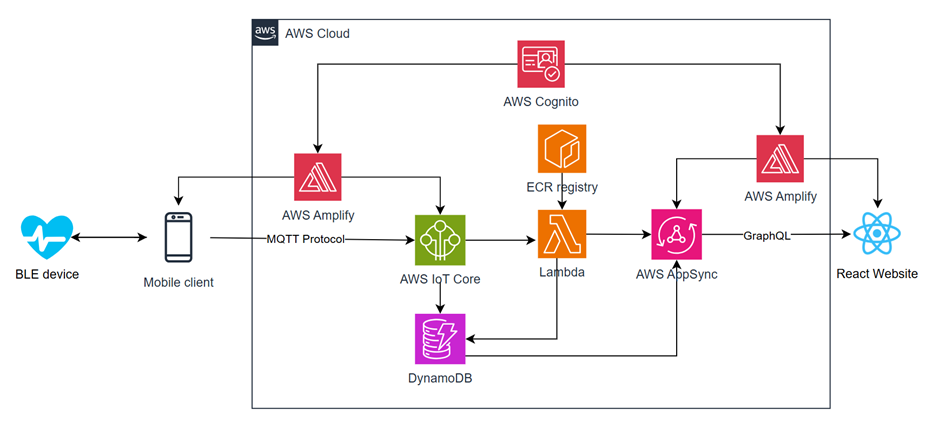
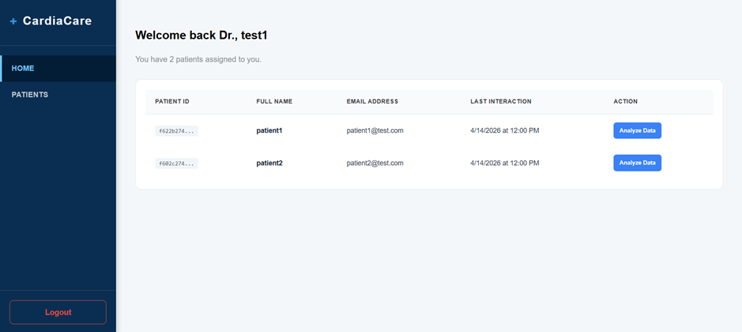
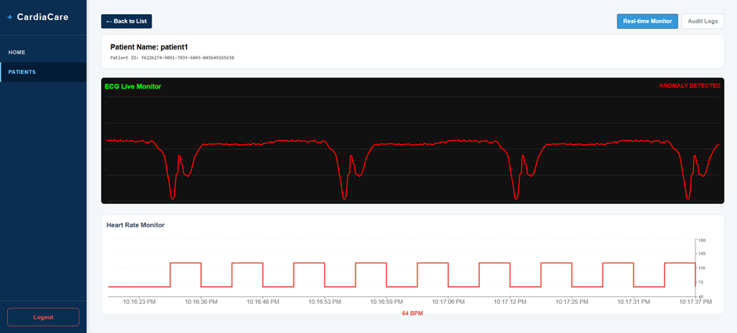
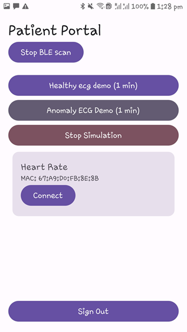
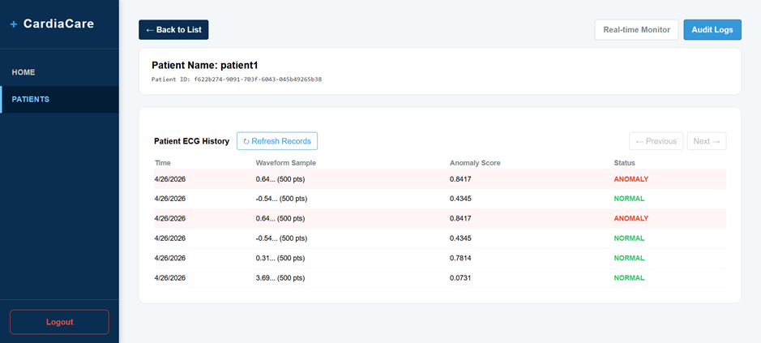

# CardiaCare - Cloud-Based Medical Remote Monitoring System

## Overview

This project implements a cloud based remote monitoring system for medical devices that collects heart rate and ecg data from Bluetooth Low Energy (BLE) devices, transmits it to a cloud-based infrastructure and performs real-time anomaly detection using an LSTM Autoencoder model. The data is then visualised on a react-based web dashboard.

## Key Metrics

| Metric                   | Value                     |
| ------------------------ | ------------------------- |
| Data ingestion rate      | ~140 Hz via MQTT over TLS |
| End-to-end latency       | ~530ms sensor to screen   |
| Anomaly detection recall | 99.2% on ECG5000 dataset  |
| ML inference latency     | Sub-250ms serverless      |

## System Architecture

The overall system architecture includes using an Android app for data acquisition from BLE devices, AWS IoT Core as cloud gateway, AWS Elastic Container for trained model Container storage, AWS Lambda for anomaly detection, DynamoDB for data storage, AppSync for retrieving data on a dashboard and React for dashboard.

---

## Tech Stack

**Mobile**

- Android (Kotlin, Jetpack Compose)
- BLE integration for heart rate and ECG signal acquisition

**Cloud Infrastructure**

- AWS IoT Core — MQTT ingestion and routing
- AWS Lambda — event-driven processing and ML inference
- AWS DynamoDB — time-series data storage
- AWS AppSync — real-time GraphQL API
- AWS ECR — containerised model hosting
- AWS Cognito — authentication and authorisation

**Machine Learning**

- LSTM Autoencoder trained on ECG5000 dataset
- PyTorch training pipeline
- Exported to ONNX for runtime-agnostic inference
- Containerised with Docker for Lambda deployment

**Frontend**

- React with Recharts for live waveform visualisation
- GraphQL subscriptions for real-time data streaming
- Role-based access control (clinician and patient views)

---

## Features

- Live ECG waveform monitoring with colour-coded anomaly alerts
- Real-time heart rate monitoring via BLE device integration
- Arrhythmia detection with instant visual feedback using LSTM Autoencoder
- Audit log with anomaly scores and timestamps
- Role-based access — clinicians see assigned patients only
- Secure data pipeline with TLS encryption end to end

---

## Screenshots

More screenshots in ui-screenshots folder

---

## ML Model

The anomaly detection model is an LSTM Autoencoder trained on the ECG5000 dataset containing 5,000 labelled ECG samples across normal and arrhythmia classes.

Training and export pipeline is in `/machine-learning`. The trained model is exported to ONNX format and containerised in Docker for deployment to AWS Lambda via ECR.

---

## Security

- MQTT communication encrypted via TLS
- AWS Cognito handles all authentication
- Dynamic IAM policy attachment via Lambda
- Role-based views separate clinician and patient access
- No credentials stored in this repository

---

## Configuration

This project requires AWS infrastructure setup and physical
Android hardware with BLE capability. Service endpoints and
credentials are excluded from this repository for security.
See the architecture section for infrastructure details.

---
